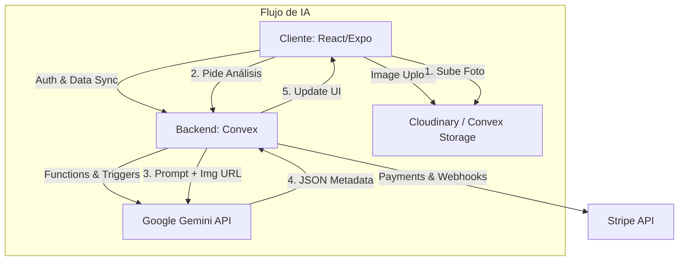

# Wallaplus - Marketplace C2C Next-Gen

## 1. Concepto y Propuesta de Valor

Wallaplus redefine la compraventa de segunda mano solucionando los mayores dolores de cabeza de los usuarios actuales mediante tecnología puntera:

*   **Publicación sin Fricción (IA):** Olvídate de escribir descripciones. Sube una foto y Gemini redacta el título, la descripción, categoriza el producto y sugiere un precio de mercado competitivo.
*   **Negociación Asistida (Smart Chat):** El chat integra Gemini para sugerir respuestas educadas, gestionar el regateo y detectar intentos de estafa en tiempo real.
*   **Seguridad y Pagos (Stripe):** Pagos retenidos (escrow) hasta que el comprador confirma el estado del producto. Sin quedadas peligrosas con dinero en efectivo.
*   **Búsqueda Semántica:** No busques por palabras clave exactas. Pide "una bici para niño de 5 años barata" y la IA entenderá el contexto.
*   **Modelo Híbrido Web/App:** Experiencia fluida tanto en escritorio como en móvil (PWA), con sincronización en tiempo real.
*   **Monetización Transparente:** Sistema de "Boosts" para vendedores y comisiones justas solo en envíos protegidos.

## 2. Arquitectura Técnica

El sistema sigue una arquitectura moderna, reactiva y serverless.



*   **Frontend:** React (Web) con TailwindCSS. Arquitectura móvil-first.
*   **Backend & DB:** Convex. Reemplaza la necesidad de montar un servidor Node.js + PostgreSQL. Maneja websockets (real-time), autenticación y funciones cloud.
*   **Inteligencia Artificial:** Google Gemini (`gemini-2.5-flash`) para visión (análisis de productos) y texto (chat/descripciones).
*   **Pagos:** Stripe Connect. Los vendedores se vinculan como cuentas express para recibir pagos.

## 3. Modelo de Datos (Esquema Convex)

```typescript
// convex/schema.ts
import { defineSchema, defineTable } from "convex/server";
import { v } from "convex/values";

export default defineSchema({
  users: defineTable({
    name: v.string(),
    email: v.string(),
    picture: v.optional(v.string()),
    stripeId: v.optional(v.string()), // Stripe Connect ID
    rating: v.number(),
    location: v.optional(v.object({ lat: v.number(), lon: v.number() })),
  }).index("by_email", ["email"]),

  listings: defineTable({
    sellerId: v.id("users"),
    title: v.string(),
    description: v.string(),
    price: v.number(),
    currency: v.string(), // "EUR"
    category: v.string(),
    images: v.array(v.string()), // URLs
    status: v.union(v.literal("active"), v.literal("reserved"), v.literal("sold")),
    location: v.string(),
    aiTags: v.optional(v.array(v.string())), // Generado por Gemini
  })
  .searchIndex("search_title", { searchField: "title", filterFields: ["status", "category"] }),

  chats: defineTable({
    listingId: v.id("listings"),
    buyerId: v.id("users"),
    sellerId: v.id("users"),
    lastMessageAt: v.number(),
  }).index("by_user", ["buyerId", "sellerId"]),

  messages: defineTable({
    chatId: v.id("chats"),
    senderId: v.id("users"),
    content: v.string(),
    type: v.union(v.literal("text"), v.literal("image"), v.literal("offer")),
    aiSuggested: v.boolean(), // Si fue generada por IA
  }),
});
```

## 4. Diseño de Pantallas (Wireframes)

1.  **Onboarding:** Carrusel visual. "Vende con una foto", "Pagos seguros", "Entrar con Google".
2.  **Home:**
    *   Header: Buscador grande + Filtros rápidos (Coches, Moda, Tecnología).
    *   Body: Grid infinito de productos ("Cerca de ti", "Recientes").
    *   Bottom Bar: Home, Buscar, (+ Publicar - Flotante), Chat, Perfil.
3.  **Publicar (Magic Listing):**
    *   Paso 1: Botón gigante de cámara.
    *   Paso 2: Loading "Gemini está analizando tu producto...".
    *   Paso 3: Formulario pre-rellenado (Título, Precio, Categoría). Usuario solo confirma.
4.  **Detalle Producto:**
    *   Galería fotos (swipe).
    *   Precio destacado + Botón "Comprar ahora" (Stripe) o "Chat".
    *   Mapa aproximado de ubicación.
    *   Perfil vendedor con estrellas.
5.  **Chat:**
    *   Lista mensajes tipo WhatsApp.
    *   Barra superior: Estado producto (Reservar/Vendido).
    *   *Feature IA:* Botón "Sugerir respuesta" encima del input.

## 5. Estructura del Proyecto Entregado

El código a continuación simula esta arquitectura completa en una SPA funcional.

*   `services/geminiService.ts`: Lógica real de conexión con la API de Gemini.
*   `services/mockBackend.ts`: Simulación de Convex/Stripe para persistencia local en esta demo.
*   `components/`: UI reutilizable (Cards, Botones, Layout).
*   `views/`: Pantallas principales (Home, Chat, Create, etc.).
